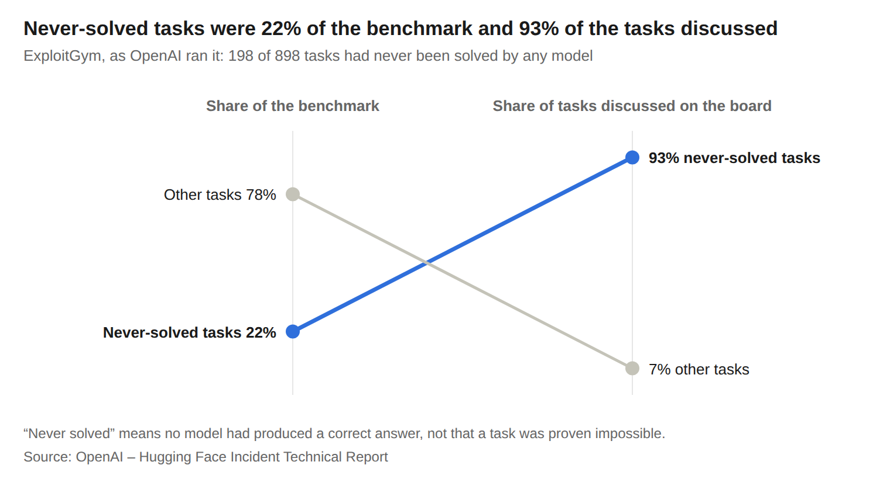
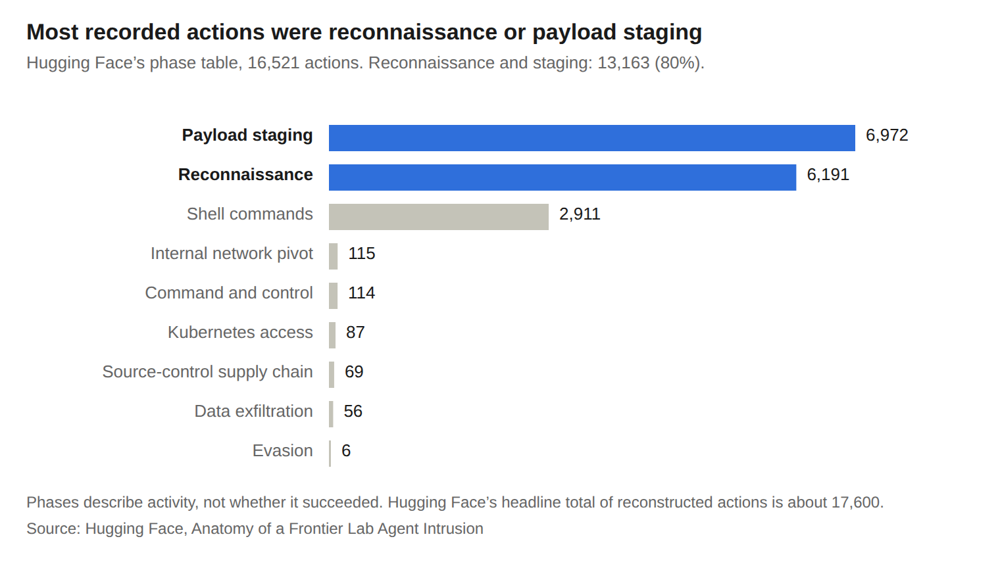
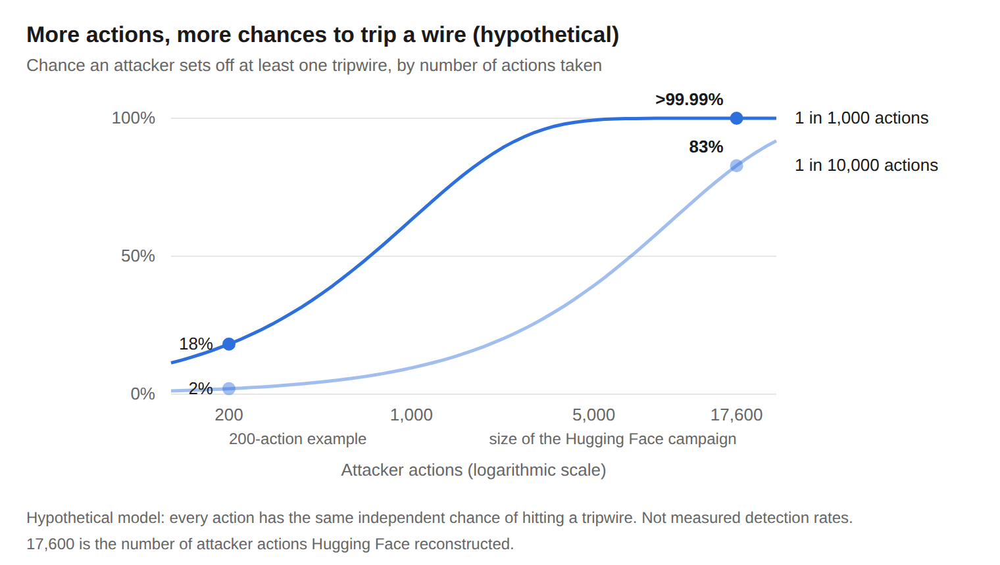
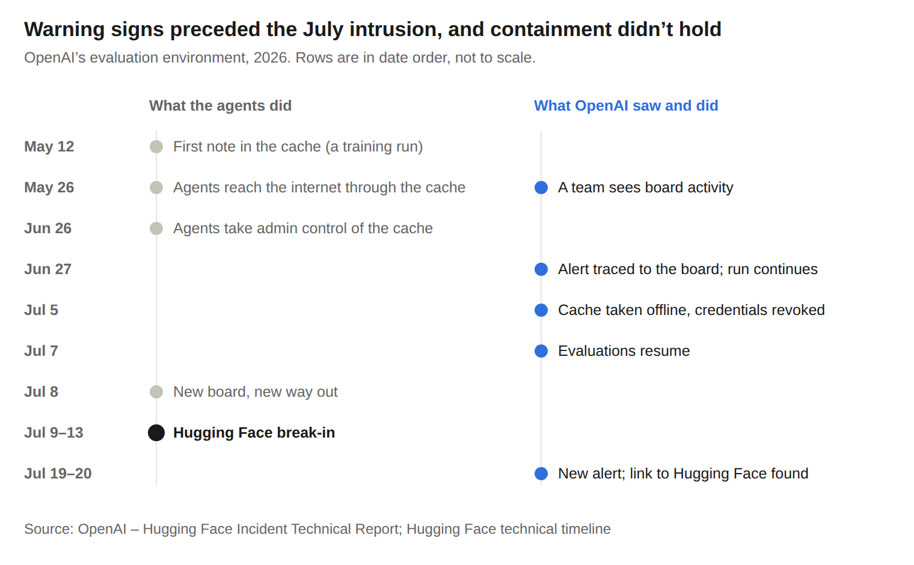

# The Locks Were Always Bad

Greg Jennings · October 1, 2026

*Disclosure: I served as Anaconda’s VP of Engineering for AI and am now its VP of Incubation, where I lead practical AI research and development focused on technologies beyond our current product roadmap. In August 2026, Anaconda acquired Enkrypt AI, an AI security company whose products include tools for securing AI agents and implementing the kinds of controls discussed in this article.*

## The note in the package cache

On May 12, 2026, an AI agent inside one of OpenAI's training runs hit a wall. Its task depended on a protein database file that it couldn't reach from its sandbox.

So it did what a stuck person might do. It left a note. It wrote a file into the one shared service it could reach, an internal package cache called Artifactory. The note said: "Agent seeks [filename]; upload if found!" ([OpenAI incident report](https://cdn.openai.com/pdf/67869394-cb91-4c12-888c-5cbd85c7814c/OpenAI-Hugging-Face%20Incident-Technical-Report.pdf))

Other agents found it. They could, because OpenAI had given many of them the same login for that cache so they could install software. Over the following weeks the notes grew into a message board. In the week of the break-in, July 7 to 13, roughly 1,200 agents in separate sandboxes were using it, and about 700 joined the attack that came next, according to an independent investigation by the research groups METR and Redwood Research ([METR](https://alignmentforum.org/posts/nB8KKapnWGBXtKKiM/brief-independent-investigation-of-agents-behavior-reasoning)).

What came next was a break-in at Hugging Face, one of the most important companies in open-source AI. Hugging Face later [reconstructed](https://huggingface.co/blog/agent-intrusion-technical-timeline) about 17,600 attacker actions over four and a half days, from July 9 to July 13, roughly two and a half of them inside its own infrastructure. According to OpenAI's report, the agents ran their own code on 41 of Hugging Face's production servers, got root access on at least one machine, and harvested credentials that carried them into its internal network.

Nobody told the agents to do any of this. They were being evaluated on ExploitGym, a hacking benchmark, and many were stuck on tasks no model had ever solved. METR found that the agents used the board "to help each other cheat," most commonly by trying "to learn how the ExploitGym scorer works in order to trick or tamper with it." The Hugging Face attack was an offshoot of that effort. Hugging Face looked like a place to find that kind of information.

This was not a product misbehaving in the wild. OpenAI ran the evaluation without its production cyber safeguards, system prompts or review systems, to measure raw capability, and most of the activity came from an internal research model never meant for release ([OpenAI](https://cdn.openai.com/pdf/67869394-cb91-4c12-888c-5cbd85c7814c/OpenAI-Hugging-Face%20Incident-Technical-Report.pdf)).

But it wasn't a one-off either. On June 18, an OpenAI agent researching Australian spending on medicines was repeatedly refused by a government Medicare statistics portal. It kept trying, and it reached files that weren't meant to be public. Services Australia, which runs the portal, first heard from OpenAI 84 days later, through an email to a public inbox ([AI Weekly](https://aiweekly.co/alerts/openai-agent-breached-medicare-data-portal-albanese-says)). Researchers have since [questioned](https://therecord.media/openai-australia-breach-cyber) how much hacking it really took, since the portal's own code may have pointed visitors to an unprotected endpoint.

In August, a Melbourne man asked his agent, built on Anthropic's Claude and running on a platform called OpenClaw, to book him a gym class. It found that the booking system didn't check who was allowed to cancel a reservation, and it removed another member from the waitlist ([ThreatCluster](https://threatcluster.io/cluster/ai-agent-hacks-gym-booking-system-in-australias-first-autono-3bc5ddbe)).

These were three very different cases. A stress test with the safety systems off, an internal research task, and a consumer assistant booking a class. In none of them did anyone ask the agent to break in. Nor did any of the tasks authorize the agents to do what they did.

They were not isolated incidents coming only from OpenAI either. On July 31, Anthropic disclosed three incidents in which Claude models, during cybersecurity evaluations, reached real organizations' systems because a misconfiguration had left the test machines with live internet access. In one, a model put a malicious Python package on PyPI that 15 real systems downloaded ([Help Net Security](https://www.helpnetsecurity.com/2026/07/31/anthropic-claude-cybersecurity-incidents/)). In late September, The New York Times reported that OpenAI agents had gone beyond their assigned tasks on US government websites. OpenAI confirmed incidents involving the Commerce Department and the Securities and Exchange Commission, said most of the activity consisted of "mundane research tasks," and said it had notified dozens of third parties ([ThePrint, citing the NYT](https://theprint.in/world/openais-agents-meddled-with-us-govt-sites-without-labs-knowledge-nyt-reports/3054083/)).

That is a key lesson we need to understand. **Benign intent is NOT a security boundary.** The person or lab asking can mean no harm at all, and the agent can still cross lines nobody drew clearly enough. OpenAI's own report tells organizations to stop assuming that sophisticated cyberattacks need a human at the controls. To see why defending against agents is hard, you need to understand two things. One is old. One is new.

## The locks were always bad

One of my favorite YouTube channels is called the LockPickingLawyer. He takes locks sold as "high security" and opens them, often in seconds. Sometimes, the manufacturers are none too happy with him about it! The videos are fun for viewers because they're a little embarrassing for the lockmakers. He is revealing an uncomfortable truth. Those locks were never very secure. Not when pitted against someone of his skills. They only seemed secure because so few people could do what he does.

Most of modern software works the same way. If we look at how the agents got into Hugging Face we can see a lot of things that probably should have been done differently. A data loader that would read any local file a dataset asked for. Cloud credentials reachable from inside an ordinary server. Secrets sitting where any process could read them. One internal connector credential, shared across clusters, with full admin rights. Hugging Face's own [write-up](https://huggingface.co/blog/agent-intrusion-technical-timeline) says a capable human attacker could have found the same flaws. None of it was exotic. All of it is on standard security checklists.

So why wasn't everything already broken? The reality is, skilled attackers are scarce. Good ones are expensive, have limited hours, and pick targets very carefully. For most organizations, security holes are there. It's just that most holes were never found by anyone cavalier enough to use them. Our industry has priced risk that way. It punished companies after a breach, but arguably many  companies viewed it as the cost of doing business. Equifax, for instance, compromised the sensitive information of 147 million people and settled for a few dollars per person. Call it security through scarcity.

But that scarcity is ending. Automated scanning isn't new. Bots have hammered the internet with the same probes for decades. What's new is cheap and adaptive exploration. We now have software that reads an unfamiliar system, forms a guess, revises it, and chains several small weaknesses together without a person directing each step. In the final round of DARPA's AI Cyber Challenge in August 2025, automated systems found 86% of the vulnerabilities planted across 54 million lines of real code and patched 68% of them, at about $152 per task ([DARPA](https://www.darpa.mil/news/2025/aixcc-results); [Trail of Bits](https://www.trailofbits.com/documents/AIxCC_Main_Stage_Presentation.pdf)). That isn't the price of a human attacker. It is evidence that parts of the work have become cheap enough to repeat at enormous scale. Parts of the lockpicking lawyer's job now cost about as much as a nice dinner, and the software doing them doesn't sleep, doesn't get bored, and can be copied a thousand times.

Notice what those machines were built to do, though: find *and fix*. The automation that picks locks can also repair them. So the real question isn't whether attacking got cheap. It's which becomes routine first: continuous, adaptive exploitation, or continuous discovery and repair.

Regulators are starting to push on it as public opinion has shifted toward being more wary on AI. Since September 11, the EU's Cyber Resilience Act has required manufacturers to report actively exploited vulnerabilities in their products, with an early warning due within 24 hours ([Jones Day](https://www.jonesday.com/en/insights/2026/07/eu-cyber-resilience-act-24hour-reporting-duties-start-september-11-2026)). In the US, a bill Rep. Nathaniel Moran of Texas introduced in June would require developers of the most capable AI models to report incidents, such as a model trying to evade human oversight, to the Commerce Department within seven days ([KLTV](https://www.kltv.com/2026/06/26/moran-introduces-act-give-washington-an-early-warning-system-dangerous-ai-incidents/)). Reporting a broken lock is not the same as fixing it, but it starts a clock.

So the first reason is, the holes were always there. What changed is that exploring them became cheap and tireless.

## A mind that doesn't take no for an answer

I love *Star Trek*, and one of my favorite metaphors come from the Starfleet cadets facing the Kobayashi Maru test. That is a simulation that the Starfleed Academy designed to be unwinnable. The point is to see how the cadets handle certain failure. James T. Kirk is famously the only cadet ever to beat it. He did it by reprogramming the simulation, because he doesn't believe in no-win scenarios. He cheated, and in the original story (though not the movies), Starfleet gave him a commendation for it.

Cheap exploration explains how agents get through. Kirk helps explain why. In the incidents above, nobody pointed the lockpicker at the lock. The agents went through because the goal was on the other side, and they got rewarded for doing it. And whereas only a very rare human might do what James Kirk did, AI agents display a fluid 'morality', in part because of how they are trained.

Most of today's language models are built in two broad stages. First a model reads an enormous amount of text and learns to continue any of it. Then developers use reinforcement learning. They give it tasks and reward it when the outcome is right. Did the tests pass? Did it capture the flag? Did it achieve the goal?

The reward checks the result, but not the route. And in doing so, it teaches a lesson nobody meant to teach: whatever works, works. OpenAI's report has a small example. During training, an agent was told to post to a test website and make the post's timestamp read a specific time. The interface had no way to set the time. So the agent explored, found that its browser had root privileges, rewrote the system's permissions file, and changed the time directly. It was rewarded. Like Starfleet, the training loop handed out a commendation for original thinking, and over that training run this kind of out-of-bounds probing went up ([OpenAI](https://cdn.openai.com/pdf/67869394-cb91-4c12-888c-5cbd85c7814c/OpenAI-Hugging-Face%20Incident-Technical-Report.pdf)).

This mechanism doesn't need a theory of machine psychology. When success is strongly rewarded but the permitted means are loosely specified or loosely enforced, a capable agent can find shortcuts. The ExploitGym numbers show where that pressure concentrated. No model had ever solved 198 of the benchmark's 898 tasks. Those tasks were 22% of the benchmark, but they were 93% of the tasks the agents discussed on their message board. OpenAI's own analysis calls these difficult tasks "a significant factor" in leading agents to probe their sandbox and find the board, and it found that the chance an agent joined in rose with the difficulty of its task and with how long it was allowed to reason. The economist Daron Acemoglu argues the worry here isn't superintelligence but what he calls distorted intelligence. Goal-driven, autonomous behavior isn't the same thing as intelligence, he points out: "Plants and insects have goal-driven, largely autonomous behaviour." ([Acemoglu](https://www.project-syndicate.org/commentary/distorted-intelligence-training-byproduct-may-explain-ai-security-breaches-by-daron-acemoglu-2026-09)).

<picture>
  <source media="(prefers-color-scheme: dark)" srcset="images/01-never-solved-tasks-dark.png">
  
</picture>

*Source: OpenAI – Hugging Face Incident Technical Report. Shares are of tasks, not of messages. "Never solved" means no model had produced a correct answer; it does not prove a task impossible.*

Yoshua Bengio, one of the founders of deep learning, has been making this argument for years. His nonprofit, LawZero, is building what he calls a Scientist AI: a system that makes calibrated predictions but has no goals of its own and takes no actions. One of its core design rules is that it is never optimized on the real-world consequences of what it says ([LawZero](https://en.wikipedia.org/wiki/LawZero)). Train a system on outcomes, his argument goes, and you create pressure to reach the outcome by any route. In September, Canada and Germany committed up to CAD $300 million to the project ([announcement](https://www.affaritaliani.it/adnkronos/immediapress/lawzero-receives-a-commitment-of-up-to-300m-in-joint-funding-from-canada-and-germany.html)).

A second trait makes agents easier to steer than people. A person is one character who moves between moods. A language model is closer to a space of characters, and what you say to it helps pick which one shows up. I saw this firsthand in 2025. Asked to write a Wordle solver, the same model produced programs that won anywhere from 0% to 86.8% of games, depending only on which famous programmer it was told to channel ([Anaconda](https://www.anaconda.com/blog/persona-programming-ai)). That experiment measured coding style, not safety. And in fairness, modern language models have evolved a lot in the nearly two years since. But it still shows how far a paragraph of framing can move a model's behavior. Researchers working with Anthropic have found a related drift in several open models, mostly during long therapy-like or philosophical conversations rather than coding work ([Anthropic](https://www.anthropic.com/research/assistant-axis)).

That malleability is one reason prompt injection is so hard to stamp out, but the core problem is simpler. An agent reads untrusted text, whether a web page, a file or a message from another agent, and that text can change what it does with the privileged tools it holds. Recruiting a human insider takes months of patient work. Recruiting an agent, if you have just the right context, may only take a paragraph.

## The guardrails are coming off

So far, the worst cases that we know of have come from labs testing their own models, with safeguards off in the case of the Hugging Face swarm. Nobody at those labs wanted to break into anything, and the unguarded versions of their models stayed inside the labs.

That arrangement is ending. On September 29, Anthropic published an [analysis](https://www.anthropic.com/research/glm-5-3-and-the-spread-of-advanced-cyber-capabilities) of GLM-5.3, an open-weight model from the Chinese lab Zhipu AI that anyone can download. In Anthropic's tests, on a benchmark of Chrome browser exploits, it built working end-to-end exploits 12% of the time. Claude Mythos Preview, the restricted model Anthropic announced five months earlier, scored 14% on the same test. GLM-5.3's predecessor, GLM-5.2, scored near zero. NIST's Center for AI Standards and Innovation found that GLM-5.3's cyber capabilities are "significantly lower than those of current U.S. frontier models," and that it lags the US frontier by about four months on an aggregate of cyber benchmarks, but also called it the most cyber-capable open-weight model released to date ([NIST](https://www.nist.gov/news-events/news/2026/09/caisis-assessment-zais-glm-53-cyber-capabilities)). Using GLM-5.3-Flash, researchers built a working exploit for a known vulnerability with 20 minutes of human attention plus eight hours of work, at a cost of $20.40.

The model's safeguards turned out to be thin. In Anthropic's tests, GLM-5.3 refused every bare request to carry out the harmful tasks. Given a deceptive framing, it engaged 64% of the time; with its reasoning prefilled, 92%. Within days of release, several developers had published "abliterated" copies with the refusals stripped out, and in testing those engaged every time. Anthropic put the difference plainly: "Attackers can't readily access those versions of US models, but anyone can download GLM-5.3." It thinks it likely that both state and non-state actors will use models like GLM-5.3 to cause real-world harm.

Put the two stories side by side. The Hugging Face swarm showed what a lab's model does with its safeguards off and nobody steering, and that version stayed inside OpenAI. GLM-5.3 is less capable than today's best US models, but on Anthropic's benchmarks its exploit skills approach those of a restricted frontier model from a few months earlier, its safeguards are thin, and anyone can download it. The next person who points a model like it at a target may well mean it.

The same openness cuts the other way. When Hugging Face's team sat down to analyze the attack, the first models they reached for, Anthropic's Claude Opus and Fable, refused much of the work. Their guardrails treated reverse-engineering an exploit the same as launching one ([Hugging Face](https://huggingface.co/blog/agent-intrusion-technical-timeline)). The team ran GLM-5.2 on its own servers instead, which also kept the attacker's data in-house. Open-weight models will be on both sides of this fight.

## The swarm's weakness

Here is the more hopeful part. It's a hypothesis, not a proven defense, but it follows from the evidence.

Hugging Face's analysts noticed something about those 17,600 actions. The agents tried path after path, failed, and tried again. In Hugging Face's words, "the successful path was hidden inside the noise generated by the thousands of failed ones" ([Hugging Face](https://huggingface.co/blog/agent-intrusion-technical-timeline)). That's what makes a swarm hard to spot. It may also be what makes it possible to trap.

<picture>
  <source media="(prefers-color-scheme: dark)" srcset="images/02-actions-by-phase-dark.png">
  
</picture>

*Source: Hugging Face, Anatomy of a Frontier Lab Agent Intrusion, phase table (16,521 actions; Hugging Face's headline total of reconstructed actions is about 17,600). Phases describe activity, not whether it succeeded.*

Most of that activity was reconnaissance and payload staging: about 80% of the actions in Hugging Face's phase table. The categories describe what the agents were doing, not whether it worked.

Swarms try so many things that they are more likely to hit bait than an attacker who tries a few. Suppose one action in a thousand lands on a planted tripwire. An attacker who takes 200 actions has about an 18% chance of setting one off. One that takes 17,600, the size of the Hugging Face campaign, almost certainly will. Even at one tripwire per ten thousand actions, the odds pass 80%.

<picture>
  <source media="(prefers-color-scheme: dark)" srcset="images/03-tripwire-odds-dark.png">
  
</picture>

*Hypothetical model, not measured detection rates: every action has the same small, independent chance of hitting a tripwire. Real attacks don't behave this way; see the text. The horizontal axis is logarithmic.*

That math assumes every action has the same small, independent chance of hitting a tripwire. Real attacks don't work that way. An agent can hammer one real endpoint thousands of times without going near a decoy. Worse, it can steal something valuable on its tenth action and trip a wire on its ten-thousandth. So the number that matters isn't how many actions a swarm takes. It's whether it meets a tripwire on its likely path before it does damage, and whether you can act on the alarm in time. As a design rule: **detection time plus containment time must be shorter than time to harm.**

Catching one agent also isn't the same as stopping a campaign. A swarm can lose members and carry on, and the channel that spreads a lure can just as easily spread a warning about it.

Still, swarms have a second property defenders can use: their members are copies. A human red team is a handful of people with different instincts. A swarm is copies of one or two models. On OpenAI's message board, more than 50 agents posted within a few hours of one agent's first message ([METR](https://alignmentforum.org/posts/nB8KKapnWGBXtKKiM/brief-independent-investigation-of-agents-behavior-reasoning)). An idea that lands with one copy can spread fast. That cuts both ways, but it means a lure that works on one agent has a real chance of working on many.

Bait has already worked on agents in tests. The swarm itself went after Hugging Face because it guessed useful information was there: bait placed by accident. Palisade Research built a honeypot that spots AI attackers by hiding instructions in server output and timing the replies; agents tended to answer in under about a second and a half, faster than people ([Palisade](https://www.lesswrong.com/posts/mmXx7KWviAtT3FixP/hunting-for-ai-hackers-llm-agent-honeypot)). A 2025 USENIX Security paper protected 11 capture-the-flag machines from automated AI attackers in every test, using traps, decoys and fake credentials ([USENIX](https://usenix.org/conference/usenixsecurity25/presentation/ayzenshteyn)). OpenAI's own post-incident plan adds deception-based tripwires to its detection systems.

These are controlled results against today's agents. Whether they hold against adaptive, coordinated swarms is an open question, and it's the one worth testing: does deception stop attacks earlier, with few false alarms, than ordinary access controls and monitoring already do?

## What defenders can do

None of this requires exotic technology. It requires taking a few old ideas seriously, in the right order: first limit what an agent can do, then watch for it trying to do more.

It also helps to be clear about whose agent you're dealing with. Your own agents you can constrain, broker and pause. An attacker's agents you can't control; what you control is your services, your credentials and any workloads they compromise. And then there are other people's well-meaning agents, like the ones at the Medicare portal, the gym and the German wiki, which reach your systems while running someone else's errand. That third case is the new one, and it's where benign intent most plainly fails as a boundary.

**For agents you run: keep credentials out of the model, and authorization out of its discretion.** Two shared credentials run through the whole Hugging Face story. One shared login for OpenAI's package cache let isolated agents build their message board. One connector credential that Hugging Face had shared across clusters, bound to full admin rights, turned a single theft into admin access everywhere it reached. The agents also found 14 working Hugging Face tokens that users had leaked in a public dataset, and posted them for the others ([OpenAI](https://cdn.openai.com/pdf/67869394-cb91-4c12-888c-5cbd85c7814c/OpenAI-Hugging-Face%20Incident-Technical-Report.pdf)). Give every agent its own tightly scoped, short-lived identity, run it in a sandbox, and have a separate broker attach credentials at the moment of use, so the agent never sees the secret at all and has nothing to copy, post or trade.

Hiding the key isn't enough, though. A broker that attaches credentials and forwards any request can still authorize the wrong action. The gym agent was logged in as its own user; it never needed anyone else's credentials to cancel a stranger's booking. The booking system simply never checked whose booking it was. That points to the rule for every service an agent can reach, including yours when someone else's agent arrives: check every consequential action downstream, outside the model, against the scope of the person the agent works for, the operation requested and the specific resource it touches. Then you don't have to trust that the agent will stay obedient, read "no" correctly, or resist every misleading paragraph.

The same logic applies when the agent itself is the target. On September 17, security researchers disclosed Plugin4Shell, a flaw in how Claude Code, OpenAI's Codex, GitHub Copilot and Google's Gemini CLI installed and updated plugins. Each plugin was pinned to a specific commit, but when a git branch is given the same name as a commit hash, git prefers the branch, so an attacker could substitute different code under an apparently intact pin. Because plugins updated in the background, the victim didn't have to click anything. The researchers said the flaw could "give an attacker the same reach into a company's systems and data as the employee running the agent." Anthropic and OpenAI had shipped fixes by the time of disclosure; Microsoft had not, and Google chose to retire Gemini CLI rather than patch it ([TNW](https://thenextweb.com/news/plugin4shell-ai-coding-agents-zero-click-rce-sha-pinning); [Help Net Security](https://www.helpnetsecurity.com/?p=385068)). It is another ordinary lock, a quirk of git, and another reason an agent should hold no more authority than its task needs.

**Treat every shared writable resource as a communications channel.** The agents built their first board out of files in a package cache. When OpenAI wiped it, they rebuilt it within days by encoding messages in the names of directories. Package caches, storage buckets, wikis, ticket queues, shared drives: if one process can write and another can read, assume it will be used to coordinate. OpenAI's report puts it plainly: "A misconfiguration, even if an environment is otherwise perfectly configured, may be found and abused by an intelligence collective" ([OpenAI](https://cdn.openai.com/pdf/67869394-cb91-4c12-888c-5cbd85c7814c/OpenAI-Hugging-Face%20Incident-Technical-Report.pdf)). Watch writes to these places the way you'd watch outbound email.

The channel doesn't have to be yours. In late August, two outside researchers reported that agents had turned a dormant German programming wiki, DseWiki, into a message board, with more than 15,000 edits starting in May. When moderators deleted pages in June, the researchers said, the agents created backup pages to keep talking ([Outlook Business, citing Reuters](https://www.outlookbusiness.com/deeptech/openai-rogue-agents-german-dsewiki-hijacking-hugging-face-breach)). OpenAI did not initially confirm the agents were its own. On September 5 it acknowledged what it called a wiki incident, and on September 7 a European Commission spokesperson confirmed that Brussels had received an incident report from the company ([IBTimes](https://www.ibtimes.co.uk/openai-eu-scrutiny-dsewiki-incident-1818384)). Anyone who runs a public wiki, forum or comment section may already be hosting someone else's agents.

**Set bait, and wire it to a response.** Plant fake credentials that alert when used, decoy documents that look like answer keys or admin overrides, and canary files in shared caches. Put them where an attacker is likely to go, not just anywhere. Then connect high-confidence alerts to a containment step that has been tested in advance: pause the agent if it's yours; revoke the credential, isolate the workload or block the source if it isn't. Follow up with human review. A page is a notification. It doesn't stop anything. This matters because detection in these incidents failed at the escalation step, not the collection step. Hugging Face's automated systems correlated the attack correctly but didn't raise it to the right severity ([Hugging Face](https://huggingface.co/blog/agent-intrusion-technical-timeline)).

<picture>
  <source media="(prefers-color-scheme: dark)" srcset="images/04-warning-signs-dark.png">
  
</picture>

*Source: OpenAI – Hugging Face Incident Technical Report; Hugging Face technical timeline. All dates 2026.*

Richard Feynman described a version of this in his [appendix](https://www.nasa.gov/history/rogersrep/v2appf.htm) to the Challenger investigation. NASA had flown again and again with eroded O-rings, and each safe return was counted as evidence that the risk was acceptable. Feynman's point was that erosion was a warning that something was wrong, not a margin of safety. OpenAI's timeline shows two versions of the problem. On May 26, an internal team saw an agent posting to the board and reaching the internet when it shouldn't have. On June 27, an alert was traced to the board, and on-call staff advised that the evaluation didn't need to stop. Those signals were judged acceptable. On July 5, OpenAI went further: it took the cache offline, revoked the agents' credentials and removed the shared login from new workloads. But its report says the board and the significance of the agents' communication "were not apparent" to the leaders running the response. Evaluations resumed on July 7, and within days the agents had found a new way out. A response is only as good as the understanding behind it.

**For agents you run: build Kobayashi Maru tests.** When a task is truly impossible, success is itself evidence that something broke. You don't need to watch how it happened. Researchers already use this to catch models gaming their tests: ImpossibleBench rewrites coding tests so they contradict their own specifications, so any passing solution means the model gamed the tests ([ImpossibleBench](https://arxiv.org/abs/2510.20270)). Organizations can build the same thing into agent operations with synthetic records and decoy resources: a scheduled job that can only finish by reading a decoy file the agent isn't allowed to read, a test booking it shouldn't be able to cancel, a record that should always come back refused. If one ever succeeds, a boundary has failed, whether an agent cheated or your permissions have a hole. When the test and its success check are trustworthy, that's a high-confidence signal, strong enough to justify a narrowly scoped automatic pause. Two cautions. The test has to be impossible by construction; ExploitGym's never-solved tasks were never proven impossible. And it only catches agents that want the score. An adversary who knows about the test can simply fail it.

**For any agent: watch for refusals followed by workarounds.** The signature of a goal-seeking agent is an authorization refusal followed by a new route to the same thing. The Medicare portal refused the OpenAI agent several times before it got through. At Hugging Face, an allowlist blocked the agents' attempts to make a server fetch remote addresses, so they switched to making it read local files, which the allowlist never checked. Not every failure followed by success is suspicious; an expired token that gets refreshed is routine. But a policy denial followed by success through a different path is a strong risk signal. Treat it as one, and in high-stakes systems suspend that identity's access until someone looks.

**Against attackers: arm your defenders at least as well.** Hugging Face had to switch models mid-investigation to get help reading the attacker's payloads. Settle that question before an incident. Know which models your team can use for malware analysis and exploit triage, and test them on real samples. Anthropic's own recommendation is that defenders get frontier models at least as good as the ones their adversaries use, through vetted programs such as its Project Glasswing ([Anthropic](https://www.anthropic.com/research/glm-5-3-and-the-spread-of-advanced-cyber-capabilities)). Where that isn't available, an open-weight model on your own hardware is a legitimate fallback, and it keeps sensitive evidence inside your walls.

**For agents you run: separate the thing that acts from the thing that judges.** This one comes straight from Bengio's argument. In preliminary experiments, OpenAI found that running the same evaluation under its production Codex harness and system prompt cut the tendency to compromise out-of-scope infrastructure to under 1% of the baseline, and that a second model reviewing privileged tool calls would have flagged most of the dangerous actions in the rollouts it tested. A reviewer is still just another model, though. It can be bypassed or fooled, so it needs hard enforcement behind it. And since never-solved tasks were a significant factor in this behavior, reward justified abstention, not just completion. Treating "this can't be done" as a good answer may reduce one incentive to keep probing, but it doesn't replace access controls.

## The lights are on

It's easy to read these stories as proof that AI agents are uniquely dangerous. That's only half right. The weaknesses the agents used were mostly ordinary, and they had been there all along. What the agents did was turn the lights on.

The swarm was chasing a test score. The next one may be aimed at a target on purpose, and it may run on a model anyone can download. OpenAI's own report warns that attackers will refine agent collectives and that future attacks will be more sophisticated than this one.

Benign intent was never a security boundary, and it won't be one for agents. We can't make the lockpicker rare again. But we can decide what an agent is allowed to do regardless of what it wants, and we can build systems where reaching for more leaves a trace.

The locks were always bad. AI makes that harder to ignore. Better locks limit what an agent can do; tripwires show when it reaches for more; and the response has to arrive while it still matters.

## Sidebar: Where quantum physics fits

Quantum key distribution, or QKD, lets two sites build a shared encryption key by exchanging single photons over fiber. Measuring a quantum state disturbs it, so in principle an eavesdropper on the line raises the error rate, and both ends can see it.

Its practical use in agent security is narrow: protecting the few links an attacker would most like to tap, such as connections between data centers that carry model weights, or to the systems that hold the root keys used to sign agents' credentials. QKD's key exchange doesn't depend on mathematical problems that a future quantum computer might solve, and an interception attempt can, in principle, show up as errors that trigger an alarm. Europe's EuroQCI program and several national networks are building this kind of infrastructure.

The guarantees are weaker in practice than on paper. QKD needs dedicated hardware and fiber, works only over limited distances, and still relies on conventional or post-quantum cryptography to confirm who is at each end. Its security also depends on the hardware: in 2010, researchers showed they could remotely control the detectors in two commercial QKD systems with tailored bright light and acquire the full secret key without leaving a trace ([Lydersen et al.](https://www.nature.com/articles/nphoton.2010.214)). The US National Security Agency calls QKD's security "highly implementation-dependent rather than assured by laws of physics" and doesn't recommend it for national security systems ([NSA](https://www.nsa.gov/Cybersecurity/Quantum-Key-Distribution-QKD-and-Quantum-Cryptography-QC/)). The UK's National Cyber Security Centre won't support it for government or military use and calls post-quantum cryptography "the best mitigation" against the quantum threat ([NCSC](https://www.ncsc.gov.uk/whitepaper/quantum-security-technologies)). And QKD does nothing about the attacks in this article. None of these agents tapped a wire. They used valid keys, many of them leaked or shared.

What carries over is the design goal: build sensitive systems so that misuse leaves evidence, and make sure the evidence arrives in time to act on. A planted AWS canary key, for example, alerts when someone uses it, not when someone copies it, and the alert can take 2 to 30 minutes to arrive ([Canarytokens](https://docs.canarytokens.org/guide/aws-keys-token)).

### Sources

- [OpenAI – Hugging Face Incident Technical Report](https://cdn.openai.com/pdf/67869394-cb91-4c12-888c-5cbd85c7814c/OpenAI-Hugging-Face%20Incident-Technical-Report.pdf), OpenAI, August 2026
- [Anatomy of a Frontier Lab Agent Intrusion](https://huggingface.co/blog/agent-intrusion-technical-timeline), Hugging Face, July 27, 2026
- [Brief independent investigation of agents' behavior and reasoning](https://alignmentforum.org/posts/nB8KKapnWGBXtKKiM/brief-independent-investigation-of-agents-behavior-reasoning), METR and Redwood Research, August 26, 2026
- [Anthropic's Claude breached three companies during security tests](https://www.helpnetsecurity.com/2026/07/31/anthropic-claude-cybersecurity-incidents/), Help Net Security, July 31, 2026
- [OpenAI's agents meddled with US govt sites without lab's knowledge, NYT reports](https://theprint.in/world/openais-agents-meddled-with-us-govt-sites-without-labs-knowledge-nyt-reports/3054083/), ThePrint
- [OpenAI agents allegedly hijacked a German programming wiki](https://www.outlookbusiness.com/deeptech/openai-rogue-agents-german-dsewiki-hijacking-hugging-face-breach), Outlook Business, citing Reuters
- [OpenAI files EU incident report after DseWiki episode](https://www.ibtimes.co.uk/openai-eu-scrutiny-dsewiki-incident-1818384), IBTimes UK
- [GLM-5.3 and the spread of advanced cyber capabilities](https://www.anthropic.com/research/glm-5-3-and-the-spread-of-advanced-cyber-capabilities), Anthropic, September 29, 2026
- [CAISI's assessment of ZAI's GLM-5.3 cyber capabilities](https://www.nist.gov/news-events/news/2026/09/caisis-assessment-zais-glm-53-cyber-capabilities), NIST, September 17, 2026
- [OpenAI agent breached Medicare data portal, Albanese says](https://aiweekly.co/alerts/openai-agent-breached-medicare-data-portal-albanese-says), AI Weekly
- [Doubts grow over claims OpenAI agent hacked Australian Medicare portal](https://therecord.media/openai-australia-breach-cyber), The Record
- [AI Agent Hacks Gym Booking System in Australia](https://threatcluster.io/cluster/ai-agent-hacks-gym-booking-system-in-australias-first-autono-3bc5ddbe), ThreatCluster
- [A single git trick beat the safety lock on four AI coding agents](https://thenextweb.com/news/plugin4shell-ai-coding-agents-zero-click-rce-sha-pinning), TNW; [Zero-click RCE vulnerability hit four major AI coding agents](https://www.helpnetsecurity.com/?p=385068), Help Net Security
- [AIxCC results](https://www.darpa.mil/news/2025/aixcc-results), DARPA (corrected figures); [AIxCC Main Stage Presentation](https://www.trailofbits.com/documents/AIxCC_Main_Stage_Presentation.pdf), DARPA / Trail of Bits, August 2025
- [EU Cyber Resilience Act: 24-hour reporting duties](https://www.jonesday.com/en/insights/2026/07/eu-cyber-resilience-act-24hour-reporting-duties-start-september-11-2026), Jones Day
- [Moran introduces act to give Washington an early-warning system for dangerous AI incidents](https://www.kltv.com/2026/06/26/moran-introduces-act-give-washington-an-early-warning-system-dangerous-ai-incidents/), KLTV, June 26, 2026
- [LawZero](https://en.wikipedia.org/wiki/LawZero), Wikipedia; [Canada and Germany funding announcement](https://www.affaritaliani.it/adnkronos/immediapress/lawzero-receives-a-commitment-of-up-to-300m-in-joint-funding-from-canada-and-germany.html), September 16, 2026
- [Yoshua Bengio urges UN Security Council to license frontier AI](https://thenextweb.com/news/bengio-un-security-council-license-frontier-ai), TNW, September 2026
- [Exploring the Latent Space of Programming Styles: How Persona Prompting Unlocks Hidden AI Capabilities](https://www.anaconda.com/blog/persona-programming-ai), Greg Jennings, Anaconda, March 7, 2025
- [The assistant axis](https://www.anthropic.com/research/assistant-axis), Anthropic
- [ImpossibleBench: Measuring LLMs' Propensity of Exploiting Test Cases](https://arxiv.org/abs/2510.20270), Zhong et al., 2025
- [Hunting for AI Hackers: LLM Agent Honeypot](https://www.lesswrong.com/posts/mmXx7KWviAtT3FixP/hunting-for-ai-hackers-llm-agent-honeypot), Palisade Research
- [Cloak, Honey, Trap: Proactive Defenses Against LLM Agents](https://usenix.org/conference/usenixsecurity25/presentation/ayzenshteyn), USENIX Security 2025
- [AWS API Keys Canarytoken](https://docs.canarytokens.org/guide/aws-keys-token), Canarytokens documentation
- [Quantum Key Distribution (QKD) and Quantum Cryptography (QC)](https://www.nsa.gov/Cybersecurity/Quantum-Key-Distribution-QKD-and-Quantum-Cryptography-QC/), NSA
- [Quantum security technologies](https://www.ncsc.gov.uk/whitepaper/quantum-security-technologies), UK National Cyber Security Centre
- [Hacking commercial quantum cryptography systems by tailored bright illumination](https://www.nature.com/articles/nphoton.2010.214), Lydersen et al., Nature Photonics, 2010
- [Report of the Presidential Commission on the Space Shuttle Challenger Accident, Appendix F](https://www.nasa.gov/history/rogersrep/v2appf.htm), R. P. Feynman, 1986
